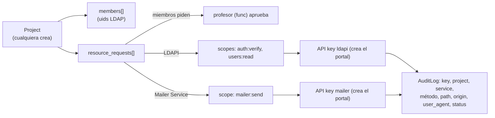
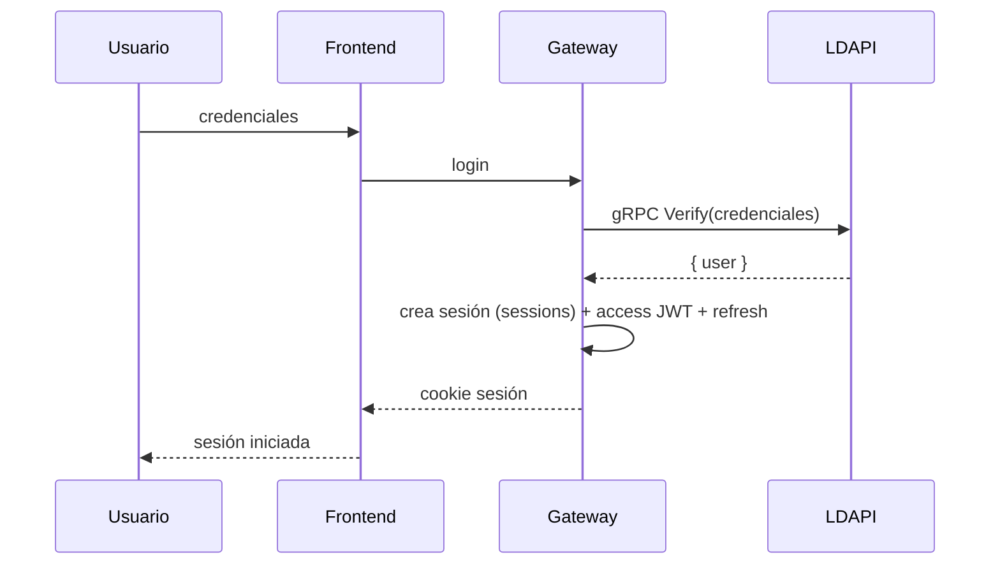
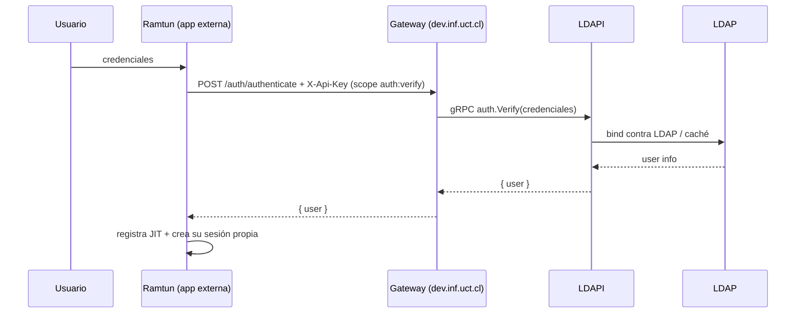
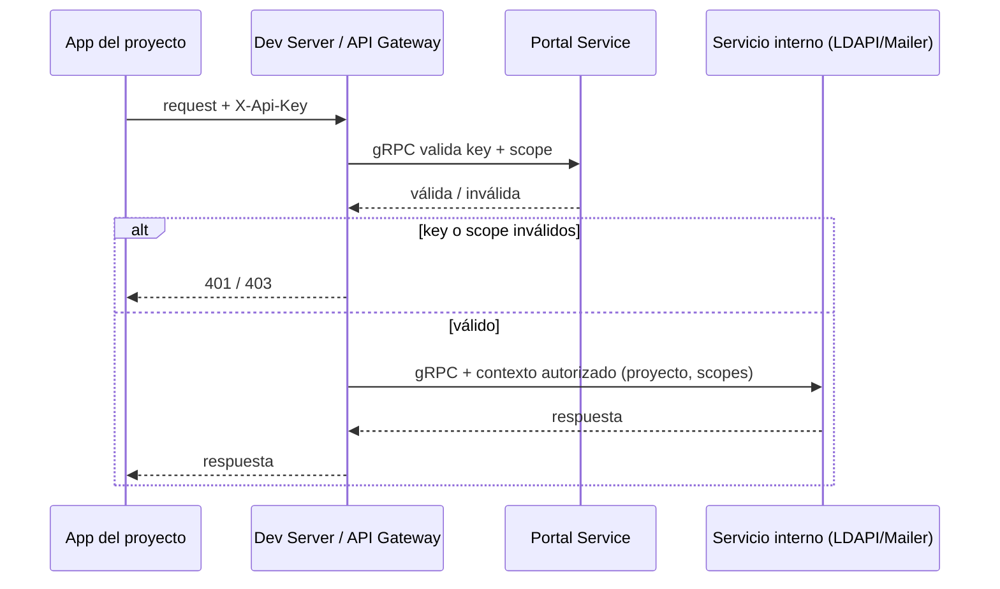

# Arquitectura — portal.inf.uct.cl

## 1. Visión y propósito

La plataforma de la carrera es un **ecosistema de servicios** pensado para que profesores y
estudiantes construyan aplicaciones sin depender de la infraestructura interna de la
universidad (LDAP, SMTP, credenciales admin, VPN).

La idea es que usuarios puedan crear proyectos, agregando sus integrantes. A través de la plataforma puedan solicitar **recursos** (identidad, directorio, correo) y, una vez aprobado, reciban **API keys por servicio** para consumirlos. Cada request queda en un **registro de auditoría** visible
para el equipo del proyecto.

## 2. Diagrama del sistema

## 3. Componentes y roles

| Componente          | Rol                                                                                                                                                                                                                                                                                                                               |
| ------------------- | --------------------------------------------------------------------------------------------------------------------------------------------------------------------------------------------------------------------------------------------------------------------------------------------------------------------------------- |
| **API Gateway**     | Expone **JSON REST** hacia el exterior (browsers y apps externas); rutea; **audita** cada request; **emite y valida la sesión de plataforma** (HS256). La validación de **API keys + scopes** la **delega al portal** por gRPC; reenvía al servicio interno con el contexto autorizado. Habla por gRPC con Portal, LDAP y Mailer. |
| **Portal Service**  | **Dominio**: projects, members, resource_requests, aprobaciones. **Posee y valida las API keys** (en su PostgreSQL): al aprobar un recurso, crea la key directo. Habla **directo con LDAP** (directorio, sin API key) y **directo con Mailer** (templates).                                                                       |
| **Frontend**        | Web general del ecosistema (dashboard de proyectos, admin, templates). Static, servida por **nginx**; llama al gateway por REST.                                                                                                                                                                                                  |
| **LDAP gRPC Layer** | **gRPC LDAP layer**: verificación de credenciales, directorio de usuarios, provisioning, sync. No maneja sesiones.                                                                                                                                                                                                                |
| **Mailer Service**  | **gRPC SMTP layer**: envío de correos + templates HTML por proyecto.                                                                                                                                                                                                                                                              |
| **LDAP**            | Fuente de verdad de usuarios (gidNumber 500/600 → student/func).                                                                                                                                                                                                                                                                  |
| **nginx**           | Reverse proxy / entry point público + sirve el frontend.                                                                                                                                                                                                                                                                          |

Cada servicio tiene su propia PostgreSQL: la del gateway guarda audit/sesiones, la del portal
projects/members/requests y las API keys, la de LDAP la caché de usuarios, la de mailer
templates.

## 4. Developer portal y dominio de proyectos

El **proyecto** es la entidad central: cualquier usuario de la carrera puede crear uno y
agregar miembros (uids de LDAP). Los proyectos solicitan acceso a **recursos** de la
plataforma; cada recurso se concede a través de **API keys por servicio** con scopes.

- **Aprobación**: los miembros solicitan → el profesor (func) del proyecto aprueba. Al aprobar,
  el portal **crea la API key** (las posee él, en su PostgreSQL).
- **Buzón compartido**: único y global (`proyectos@inf.uct.cl`). Todos los envíos del
  proyecto usan ese `from`.
- **Auditoría**: cada request autorizado se registra; visible por el profesor (owner) y admin.
- El portal busca usuarios en LDAPI por gRPC **interno** (sin API key) y gestiona los
  templates de mailer por gRPC directo.
- **Mailer**: tipo Resend — templates HTML con variables interpolables por proyecto,
  gestionados desde el frontend (ver §7).

## 5. Autenticación

### 5.1 Plataforma (interna)

La sesión de la plataforma replica el flujo de auth de ramtun, pero con LDAPI como
backend de credenciales en vez de LDAP directo. La emite y valida **el gateway**, y distribuye la identidad al portal/frontend:

- Login por form en el frontend → el gateway delega la **verificación de credenciales** en
  LDAPI por gRPC.
- El gateway crea la sesión (tabla `sessions` en su PostgreSQL) y emite **access JWT +
  refresh** firmados con **secret compartida (HS256)**, como ramtun.
- Entrega por cookie `DEV_INF_UCT_SESSION` (HttpOnly, Secure, SameSite=Lax); refresh/revoke
  igual que ramtun.
- **El JWT es solo el identificador de la sesión de la plataforma**: solo el gateway lo
  emite y valida; ningún servicio interno ni app externa lo verifica.

### 5.2 Apps externas (ej. ramtun)

- Cada app mantiene sus propias sesiones.
- Comprueban credenciales contra la plataforma: `POST /auth/authenticate` con su API key
  (scope `auth:verify`) → LDAPI verifica contra LDAP → `{ user }` → la app
  registra JIT y crea su sesión propia.
- La app nunca recibe el JWT de la plataforma.

## 6. Autorización de máquinas (API keys gestionadas por el portal)

- Las **API keys se gestionan y validan en el Portal Service** una
  **por servicio** con sus scopes aprobados. El portal las crea al aprobar un recurso.
- El gateway recibe la llamada del externo con la key, **consulta al portal** por gRPC si la
  key es válida para el scope del recurso, y si lo es **reenvía al servicio interno con el
  contexto autorizado** (proyecto y scopes aprobados) para que aplique sus propias reglas
  (p. ej. qué buzón puede usar un proyecto).
- **Los servicios internos (LDAPI, Mailer) confían en ese contexto y nunca ven ni validan
  API keys.**
- Scopes: `auth:verify`, `users:read` (LDAPI) · `mailer:send` (Mailer).
- `mailer:send` es el único scope de mailer: cubre el envío con templates. Los templates
  no se gestionan por API key, sino por sesión de plataforma (§7).
- Tradeoff: la validación por el portal agrega un RPC gateway→portal por request; se acepta
  a cambio de tener una única autoridad de credenciales (el dominio).

## 7. Mailer Service

Mailer funciona como un servicio de envío tipo **Resend**: los proyectos crean
**templates HTML con variables interpolables** y envían correos referenciando un template.

- **Templates por proyecto**: `name`, `subject`, `html_body`, `variables[]` (ej. `{{nombre}}`).
- **Gestión**: frontend → gateway (sesión de plataforma, **cualquier miembro del proyecto**)
  → **portal** → mailer por gRPC. No es público por API key.
- **Envío**: `POST /mail/send { template_id, to, variables }` con API key `mailer:send`.
  Mailer interpola las variables en el HTML, usa `from = proyectos@inf.uct.cl` (buzón
  compartido) y envía por SMTP.
